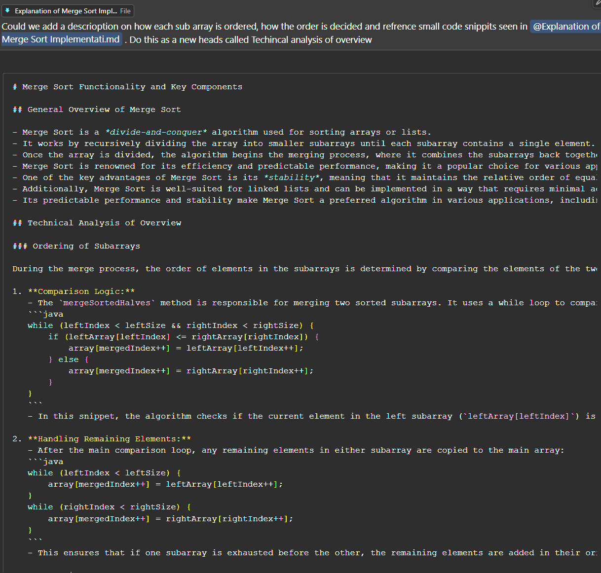
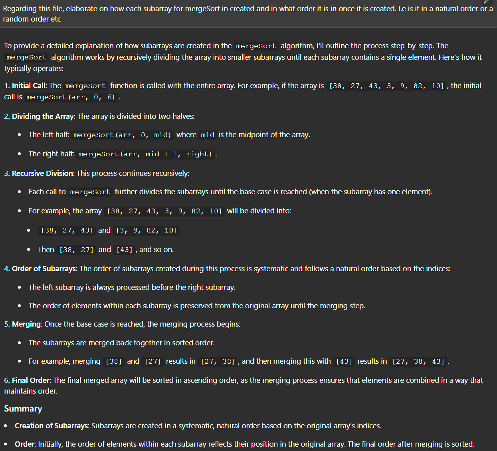

```markdown
# Merge Sort Functionality and Key Components

## 1. General Overview of Merge Sort

Merge Sort is a divide-and-conquer algorithm used for sorting arrays or lists of large data sets. It works by recursively dividing the array into smaller subarrays until each subarray contains a single element. This division is crucial as it simplifies the sorting process, allowing for easier merging later on. Once the array is divided, the algorithm begins the merging process, where it combines the subarrays back together in a sorted manner. This merging continues until the entire array is sorted.

Merge Sort is renowned for its efficiency and predictable performance, making it a popular choice for various applications. It operates with a time complexity of O(n log n) in the average and worst cases, which is significantly better than simpler algorithms like Bubble Sort or Insertion Sort, especially for large datasets.

One of the key advantages of Merge Sort is its *stability*, meaning that it maintains the relative order of equal elements. This is essential in certain applications where the order of similar items matters.

Additionally, Merge Sort is well-suited for linked lists, although it still requires additional space for temporary storage of the merged sublists.

Its predictable performance and stability make Merge Sort a preferred algorithm in various applications, including sorting large datasets, external sorting (where data is too large to fit into memory), and in scenarios where consistent performance is critical.

## 2. How Merge Sort Works

Here's a step-by-step breakdown of how Merge Sort typically operates:

1. **Initial Call**: The `mergeSort` function is called with the entire array. For example, if the array is `[38, 27, 43, 3, 9, 82, 10]`, the initial call is `mergeSort(arr, 0, 6)`.

2. **Dividing the Array**: The array is divided into two halves:
   - The left half: `mergeSort(arr, 0, mid)` where `mid` is the midpoint of the array.
   - The right half: `mergeSort(arr, mid + 1, right)`.

3. **Recursive Division**: This process continues recursively:
   - Each call to `mergeSort` further divides the subarrays until the base case is reached (when the subarray has one element).
   - For example, the array `[38, 27, 43, 3, 9, 82, 10]` will be divided into:
     - `[38, 27, 43]` and `[3, 9, 82, 10]`
     - Then `[38, 27]` and `[43]`. As well as `[3, 9]` and `[82, 10]`. 
     - `[38]` and `[27]` are next. Then `[3]` and `[9]`. Finally `[82]` and `[10]`.

4. **Order of Subarrays**: The order of subarrays created during this process is systematic and follows a natural order based on the indices:
   - The left subarray is always processed before the right subarray.
   - The order of elements within each subarray is preserved from the original array until the merging step.

5. **Merging**: Once the base case is reached, the merging process begins:
   - The subarrays are merged back together in sorted order.
   - For example, merging `[38]` and `[27]` results in `[27, 38]`, and then merging this with `[43]` results in `[27, 38, 43]`.

6. **Final Order**: The final merged array will be sorted in ascending order, as the merging process ensures that elements are combined in a way that maintains order.

### 3. Summary of Basic Process

- **Creation of Subarrays**: Subarrays are created in a systematic, natural order based on the original array's indices. 
- **Order**: Initially, the order of elements within each subarray reflects their position in the original array. The final order after merging is sorted.

#### 3.1. Key Concepts

- **Stability:** Merge Sort maintains the relative order of equal elements, which is crucial for maintaining the relative order of equal elements in the sorted array.

## 5. Code of Classic Merge Sort

```java


public class MergeSort {
    public void Sort(int[] array) {
        if (array == null || array.length <= 1) {
            return;
    }
    int[] tempArray = new int[array.length];
    performMergeSort(array, tempArray, 0, array.length - 1);
}

private void performMergeSort(int[] array, int[] tempArray, int left, int right) {
    if (left < right) {
        int middle = left + (right - left) / 2;
        performMergeSort(array, tempArray, left, middle);
        performMergeSort(array, tempArray, middle + 1, right);
        merge(array, tempArray, left, middle, right);
    }
}

public class Merger {
    public void merge(int[] array, int[] tempArray, int left, int middle, int right) {
        for (int i = left; i <= right; i++) {
            tempArray[i] = array[i];
    }
    int i = left;
    int j = middle + 1;
    int k = left;
    while (i <= middle && j <= right) {
        if (tempArray[i] <= tempArray[j]) {
            array[k++] = tempArray[i++];
        } else {
            array[k++] = tempArray[j++];
        }
    }
    while (i <= middle) {
        array[k++] = tempArray[i++];  
    }
}
```

### 5.1. Key Characteristics

- **Stable**: Maintains the relative order of equal elements.
- **Consistent Performance**: O(n log n) time complexity for all cases.
- **External Sorting**: Efficient for large datasets that do not fit into memory.

- The stability of Merge Sort means that equal elements retain their original order, which is crucial for maintaining the relative order of equal elements in the sorted array.
- The consistency of Merge Sort ensures that its performance is predictable and reliable, making it a valuable tool for sorting tasks in various applications. This is highlighted by its consistent time complexity of O(n log n), which is efficient and reliable for sorting large datasets.

## 6. Key Components of the Merge Sort Algorithm

### 6.1. `performMergeSort` Method

The `performMergeSort` method is the core of the Merge Sort algorithm. It recursively divides the array into smaller segments, sorts them, and then merges the sorted segments.

```java
/**
 * Performs the merge sort algorithm on the specified array segment.
 *
 * @param array      The array to be sorted.
 * @param start The starting index of the array segment.
 * @param end   The ending index of the array segment.
 */
public static void performMergeSort(int[] array, int start, int end) {
    if (start >= end) return;
    
    int middle = start + (end - start) / 2;
    performMergeSort(array, start, middle);
    performMergeSort(array, middle + 1, end);
    mergeSortedHalves(array, start, middle, end);
}
```

**Explanation:**

- **Base Case:** The method first checks if the current segment of the array has more than one element (`startIndex < endIndex`). If not, the segment is already sorted.
  
- **Finding the Middle:** It calculates the `middleIndex` to divide the array into two halves. Using `startIndex + (endIndex - startIndex) / 2` prevents potential integer overflow.
  
- **Recursive Sorting:** The method recursively calls itself to sort the left half (`startIndex` to `middleIndex`) and the right half (`middleIndex + 1` to `endIndex`).
  
- **Merging:** After sorting both halves, it calls the `mergeSortedHalves` method to merge the two sorted subarrays into a single sorted segment.

### 6.2. `mergeSortedHalves` Method

The `mergeSortedHalves` method is responsible for merging two sorted subarrays into a single sorted segment. It ensures that the combined array maintains the sorted order.

```java
/**
 * Merges two sorted subarrays of the specified array.
 *
 * @param array       The array containing the subarrays.
 * @param startIndex  The starting index of the left subarray.
 * @param middleIndex The ending index of the left subarray and the middle point.
 * @param endIndex    The ending index of the right subarray.
 */
public static void mergeSortedHalves(int[] array, int startIndex, int middleIndex, int endIndex) {
    int leftSize = middleIndex - startIndex + 1; // Calculate the size of the left subarray
    int rightSize = endIndex - middleIndex; // Calculate the size of the right subarray

    // Create temporary arrays
    int[] leftArray = Arrays.copyOfRange(array, startIndex, middleIndex + 1);
    int[] rightArray = Arrays.copyOfRange(array, middleIndex + 1, endIndex + 1);

    // Merge the temporary arrays back into array[startIndex..endIndex]
    int leftIndex = 0, rightIndex = 0, mergedIndex = startIndex;
    while (leftIndex < leftSize && rightIndex < rightSize) {
        if (leftArray[leftIndex] <= rightArray[rightIndex]) {
            array[mergedIndex++] = leftArray[leftIndex++];
        } else {
            array[mergedIndex++] = rightArray[rightIndex++];
        }
    }

    // Copy remaining elements of leftArray[] if any
    while (leftIndex < leftSize) {
        array[mergedIndex++] = leftArray[leftIndex++];
    }

    // Copy remaining elements of rightArray[] if any
    while (rightIndex < rightSize) {
        array[mergedIndex++] = rightArray[rightIndex++];
    }
}
```

**Explanation:**

- **Determining Sizes:** 
  - `leftSize = middleIndex - startIndex + 1`: This calculates the size of the left subarray. We add 1 because `middleIndex` is inclusive in the left subarray.
  - `rightSize = endIndex - middleIndex`: This calculates the size of the right subarray. We don't add 1 here because `middleIndex` is not included in the right subarray.

  For example, if we have an array of 7 elements [0, 1, 2, 3, 4, 5, 6] and `middleIndex` is 3:
  - Left subarray would be [0, 1, 2, 3], so `leftSize = 3 - 0 + 1 = 4`
  - Right subarray would be [4, 5, 6], so `rightSize = 6 - 3 = 3`

- **Creating Temporary Arrays:** It creates temporary arrays `leftArray` and `rightArray` by copying the relevant segments from the original array using `Arrays.copyOfRange`.
  
- **Merging Process:**
  - Initializes three pointers: `leftIndex`, `rightIndex`, and `mergedIndex` to track positions in the left array, right array, and the main array, respectively.
  - Iterates through both temporary arrays, comparing elements and placing the smaller one into the main array.
  
- **Copying Remaining Elements:** After the main loop, if there are any remaining elements in either `leftArray` or `rightArray`, they are copied into the main array to complete the merge.

This method ensures that the two sorted subarrays are combined into a single sorted array segment, maintaining the overall order of elements.

## 7. Technical Analysis of Overview

### 7.1. Ordering of Subarrays

The ordering of subarrays in Merge Sort is a crucial aspect that ensures the final array is correctly sorted. This process occurs during the merge phase and involves careful comparison and placement of elements.

1. **Initial State of Subarrays:**
   - Before merging, we have two sorted subarrays: the left subarray and the right subarray.
   - For example, if we're merging [1, 3, 5] and [2, 4, 6], both subarrays are already sorted internally.

2. **Comparison Logic:**
   - The `mergeSortedHalves` method is responsible for merging these sorted subarrays. It uses a while loop to compare elements:

   ```java
   while (leftIndex < leftSize && rightIndex < rightSize) {
       if (leftArray[leftIndex] <= rightArray[rightIndex]) {
           array[mergedIndex++] = leftArray[leftIndex++];
       } else {
           array[mergedIndex++] = rightArray[rightIndex++];
       }
   }
   ```

   - This loop compares the current elements from both subarrays and places the smaller (or equal) element into the main array.
   - For our example:
     - First comparison: 1 vs 2 -> 1 is placed first
     - Second comparison: 3 vs 2 -> 2 is placed second
     - Third comparison: 3 vs 4 -> 3 is placed third
     - And so on...

3. **Maintaining Stability:**
   - The use of `<=` in the comparison `leftArray[leftIndex] <= rightArray[rightIndex]` is crucial for maintaining stability.
   - If elements are equal, the element from the left subarray is placed first. This ensures that the relative order of equal elements is preserved from the original array.

4. **Handling Remaining Elements:**
   - After the main comparison loop, any remaining elements in either subarray are copied to the main array:

   ```java
   while (leftIndex < leftSize) {
       array[mergedIndex++] = leftArray[leftIndex++];
   }
   while (rightIndex < rightSize) {
       array[mergedIndex++] = rightArray[rightIndex++];
   }
   ```

   - This step ensures that if one subarray is exhausted before the other, the remaining elements (which are already in order) are added to the end of the merged array.
   - In our example, after placing [1, 2, 3, 4, 5], the remaining 6 from the right subarray would be placed at the end.

5. **Final Ordered Result:**
   - After the merge process, the segment of the main array that was being worked on is now fully sorted.
   - In our example, the final merged and sorted array would be [1, 2, 3, 4, 5, 6].

### 7.2. Recursive Nature of Ordering as Described by AI (Gemini 1.5 Flash 500k)

It's important to note that this merging process happens at various levels due to the recursive nature of Merge Sort:

1. **Leaf Level:** At the deepest level of recursion, we're merging single-element subarrays, which are inherently sorted.

2. **Intermediate Levels:** As we move up the recursion tree, we're merging larger and larger sorted subarrays.

3. **Root Level:** The final merge at the top level combines two large sorted halves of the entire array.

This recursive structure ensures that by the time we reach the final merge, we're dealing with two large, sorted subarrays, making the final merge efficient and straightforward.

### 7.3. Parallel Merge Sort as Described by AI (Claude 3.5 Sonnet 200k)

We can add parallel processing to potentially improve performance for large arrays:

```java
import java.util.concurrent.RecursiveAction;
import java.util.concurrent.ForkJoinPool;

public class ParallelMergeSort extends RecursiveAction {
    private int[] array;
    private int start, end;
    private static final int THRESHOLD = 1000;

    public ParallelMergeSort(int[] array, int start, int end) {
        this.array = array;
        this.start = start;
        this.end = end;
    }

    @Override
    protected void compute() {
        if (end - start <= THRESHOLD) {
            MergeSort.performMergeSort(array, start, end);
        } else {
            int middle = start + (end - start) / 2;
            ParallelMergeSort left = new ParallelMergeSort(array, start, middle);
            ParallelMergeSort right = new ParallelMergeSort(array, middle + 1, end);
            invokeAll(left, right);
            new Merger().merge(array, start, middle, end);
        }
    }

    public static void parallelSort(int[] array) {
        ForkJoinPool.commonPool().invoke(new ParallelMergeSort(array, 0, array.length - 1));
    }
}
```

### 7.3. Example Breakdown as Described by AI (Gemini 1.5 Flash 500k)

Let's say we have the following array:

```
[38, 27, 43, 3, 9, 82, 10]
```

After the recursive division, we have two sorted subarrays:

```
leftArray: [27, 38, 43]
rightArray: [3, 9, 10, 82]
```

Now, the `mergeSortedHalves` method will merge these two subarrays back into the original array.

**Step 1: Initialization**

- `leftIndex = 0`, `rightIndex = 0`, `mergedIndex = 0`

**Step 2: Merging Loop**

- **Iteration 1:**
    - `leftArray[leftIndex] = 27`, `rightArray[rightIndex] = 3`
    - `27 > 3`, so `array[mergedIndex++] = rightArray[rightIndex++]`
    - `array[0] = 3`, `leftIndex = 0`, `rightIndex = 1`, `mergedIndex = 1`

- **Iteration 2:**
    - `leftArray[leftIndex] = 27`, `rightArray[rightIndex] = 9`
    - `27 > 9`, so `array[mergedIndex++] = rightArray[rightIndex++]`
    - `array[1] = 9`, `leftIndex = 0`, `rightIndex = 2`, `mergedIndex = 2`

- **Iteration 3:**
    - `leftArray[leftIndex] = 27`, `rightArray[rightIndex] = 10`
    - `27 > 10`, so `array[mergedIndex++] = rightArray[rightIndex++]`
    - `array[2] = 10`, `leftIndex = 0`, `rightIndex = 3`, `mergedIndex = 3`

- **Iteration 4:**
    - `leftArray[leftIndex] = 27`, `rightArray[rightIndex] = 82`
    - `27 < 82`, so `array[mergedIndex++] = leftArray[leftIndex++]`
    - `array[3] = 27`, `leftIndex = 1`, `rightIndex = 3`, `mergedIndex = 4`

- **Iteration 5:**
    - `leftArray[leftIndex] = 38`, `rightArray[rightIndex] = 82`
    - `38 < 82`, so `array[mergedIndex++] = leftArray[leftIndex++]`
    - `array[4] = 38`, `leftIndex = 2`, `rightIndex = 3`, `mergedIndex = 5`

- **Iteration 6:**
    - `leftArray[leftIndex] = 43`, `rightArray[rightIndex] = 82`
    - `43 < 82`, so `array[mergedIndex++] = leftArray[leftIndex++]`
    - `array[5] = 43`, `leftIndex = 3`, `rightIndex = 3`, `mergedIndex = 6`

**Step 3: Handling Remaining Elements**

- `leftIndex = 3`, `rightIndex = 3`, `mergedIndex = 6`
- `leftIndex >= leftSize`, so the loop terminates.
- `rightIndex < rightSize`, so the remaining element in `rightArray` is copied to `array`:
    - `array[6] = 82`

**Final Result:**

The merged array is now:

```
[3, 9, 10, 27, 38, 43, 82]
```

This is the sorted version of the original array.
              

## 8. Time and Space Complexity of Merge Sort

### 8.1. Time Complexity: **O(n log n)** as Described by AI (Gemini 1.5 Flash 500k)

- **Divide Phase:** 
  - The array is recursively divided into two halves until each subarray has only one element.
  - The depth of the recursion tree is `log n`, where `n` is the number of elements in the array.

- **Conquer Phase (Merging):**
  - At each level of recursion, the merging process takes linear time `O(n)` since each element is compared and merged.
  
- **Overall Complexity:**
  - Combining both phases, the total time complexity becomes `O(n log n)` for all cases (best, average, and worst).

### 8.2. Space Complexity: **O(n)** as Described by AI (Gemini 1.5 Flash 500k)

- **Auxiliary Space for Temporary Arrays:**
  - The algorithm uses temporary arrays (`leftArray` and `rightArray`) to store the divided segments during the merge process.
  - At any point, the total size of these temporary arrays is proportional to the size of the input array, resulting in `O(n)` space.
  
- **Recursive Call Stack:**
  - The depth of the recursion stack is `log n`, and each recursive call consumes constant space.
  - Therefore, the space used by the call stack is `O(log n)`.
  
- **Dominant Factor:**
  - The auxiliary space for temporary arrays (`O(n)`) dominates the space used by the call stack (`O(log n)`), making the overall space complexity `O(n)`.

**Conclusion:**

The Merge Sort algorithm offers a consistent and efficient sorting mechanism with a time complexity of `O(n log n)` and a space complexity of `O(n)`. Its divide-and-conquer approach makes it highly effective for large datasets, and the algorithm's stability ensures that equal elements retain their original order post-sorting.

## 9 Merge Sort for Linked Lists 
### 9.1. Basic Idea as Described by AI (Gemini 1.5 Flash 500k)

Merge Sort can also be implemented for linked lists. The basic idea is the same: divide the linked list into two halves, recursively sort each half, and then merge the sorted halves. However, the implementation details are slightly different due to the nature of linked lists.

Here's a basic outline of how Merge Sort for linked lists would work:

1. **Divide:**
   - Find the middle node of the linked list.
   - Split the linked list into two halves at the middle node.

2. **Conquer:**
   - Recursively sort the left half of the linked list.
   - Recursively sort the right half of the linked list.

3. **Merge:**
   - Create a new linked list to store the merged result.
   - Compare the first nodes of the two sorted halves.
   - Add the smaller node to the merged linked list.
   - Repeat steps 3 and 4 until one of the halves is empty.
   - Append the remaining nodes of the non-empty half to the merged linked list.

The space complexity of Merge Sort for linked lists is still `O(n)` because it requires temporary storage for the merged sublists. However, the time complexity remains `O(n log n)`.

**Note:** The implementation of Merge Sort for linked lists is more complex than for arrays, and it requires careful handling of pointers and node manipulation.

## 10. Conclusion
### 10.1. Summary as Described by AI (Gemini 1.5 Flash 500k)

Merge Sort is a versatile sorting algorithm with a consistent time complexity of `O(n log n)` and a space complexity of `O(n)`. Its stability and efficiency make it a popular choice for various sorting tasks, including sorting large datasets, external sorting, and sorting linked lists.

# 11. Reflections on AI-Assisted Learning

## 11.1 Methodology and Tools

- **AI Model Selection:** Local AI models are preferred over web-based alternatives for improved accuracy.
- **Documentation Sources:** Utilize comprehensive Java documentation, including:
  - JDK 22 Docs
  - Core Libraries API Specification
  - Language Specification
  - JVM Specification
  - Sequenced Collections API Specification
  - Java Collections API docs
- **Custom Indexing:** Employ local indexing and processing for tailored, project-specific responses.

## 11.2 Comparative Analysis of AI Models

- **Short Context Window Models (e.g., Cursor-Small):**
  - Performance comparable to web-based AI assistants
- **Large Context Window Models (e.g., Gemini Flash 1.5 500k):**
  - Consistently superior performance
  - Faster response times
  - Custom indexing capabilities
  - Advanced tools like Smart Reranker and Smart Reranker Filter

## 11.3 Effectiveness of AI Responses

- **Quality:** Responses are consistently high-quality, particularly for algorithm analysis.
- **Adherence to Guidelines:** AI follows specified constraints and best practices.
- **Learning Support:** Acts as both a documentation reference and a conceptual tutor.
- **Clarity:** Explanations are tailored to be easily understandable without extraneous details.

## 11.4 Benefits of the Approach

1. Enhanced accuracy and reliability of explanations
2. Customized responses aligned with project requirements
3. Streamlined learning process for complex concepts
4. Consistent adherence to best practices and documentation standards

This refined approach to AI-assisted learning leverages the strengths of local models and comprehensive documentation to provide a superior educational experience in software development and algorithm analysis.

# Screenshots




# Misc

```
4. Relativity to Internship Setting:

In an internship setting, you might need to integrate Merge Sort into a larger system. For example, as part of a RESTful API:

```java
@RestController
@RequestMapping("/api/sort")
public class SortController {
    @PostMapping("/merge")
    public ResponseEntity<int[]> mergeSort(@RequestBody int[] array) {
        MergeSort.sort(array);
        return ResponseEntity.ok(array);
    }
}
```