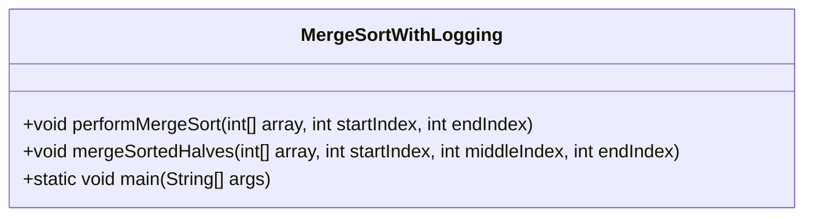
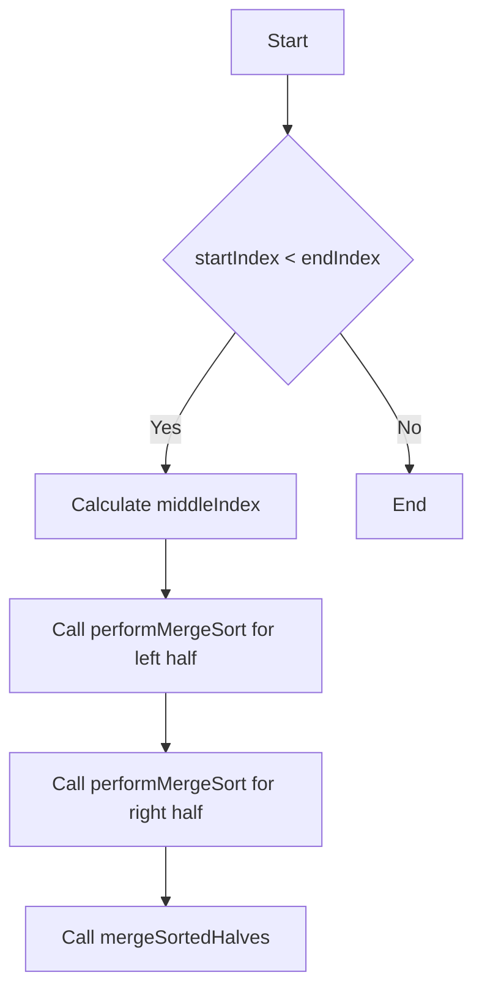
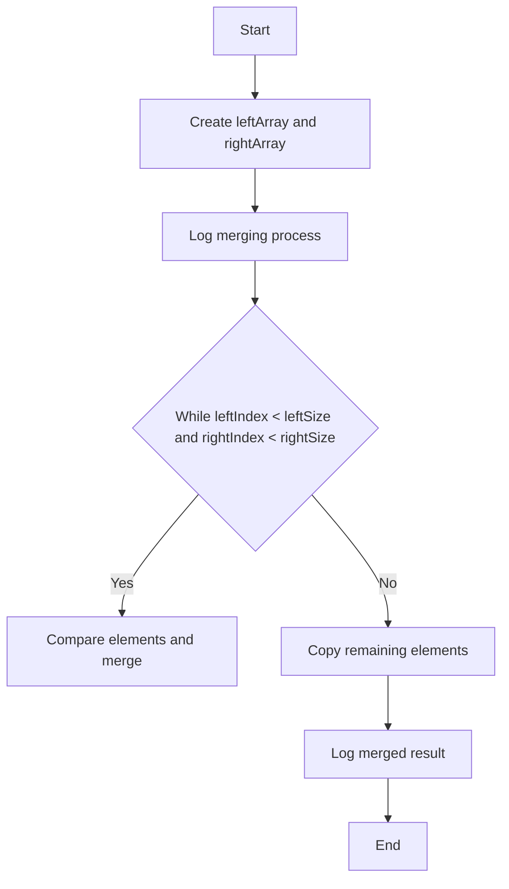

package mergesortgradlev1;

import java.util.Arrays;
import java.util.logging.Logger;

public class MergeSortWithLogging {
    private static final Logger logger = Logger.getLogger(MergeSortWithLogging.class.getName());

    public static void performMergeSort(int[] array, int startIndex, int endIndex) {
        logger.info("Sorting array segment: " + Arrays.toString(Arrays.copyOfRange(array, startIndex, endIndex + 1)));
        
        if (startIndex < endIndex) {
            int middleIndex = startIndex + (endIndex - startIndex) / 2;

            // Recursively sort the first half
            performMergeSort(array, startIndex, middleIndex);

            // Recursively sort the second half
            performMergeSort(array, middleIndex + 1, endIndex);

            // Merge the sorted halves
            mergeSortedHalves(array, startIndex, middleIndex, endIndex);
        }
    }

    public static void mergeSortedHalves(int[] array, int startIndex, int middleIndex, int endIndex) {
        int leftSize = middleIndex - startIndex + 1;
        int rightSize = endIndex - middleIndex;

        int[] leftArray = Arrays.copyOfRange(array, startIndex, middleIndex + 1);
        int[] rightArray = Arrays.copyOfRange(array, middleIndex + 1, endIndex + 1);

        logger.info("Merging left: " + Arrays.toString(leftArray) + " and right: " + Arrays.toString(rightArray));

        int leftIndex = 0, rightIndex = 0, mergedIndex = startIndex;
        while (leftIndex < leftSize && rightIndex < rightSize) {
            if (leftArray[leftIndex] <= rightArray[rightIndex]) {
                array[mergedIndex++] = leftArray[leftIndex++];
            } else {
                array[mergedIndex++] = rightArray[rightIndex++];
            }
        }

        while (leftIndex < leftSize) {
            array[mergedIndex++] = leftArray[leftIndex++];
        }

        while (rightIndex < rightSize) {
            array[mergedIndex++] = rightArray[rightIndex++];
        }

        logger.info("Merged array segment: " + Arrays.toString(Arrays.copyOfRange(array, startIndex, endIndex + 1)));
    }

    public static void main(String[] args) {
        int[] array = {5, 2, 8, 1, 3};
        logger.info("Initial array: " + Arrays.toString(array));
        performMergeSort(array, 0, array.length - 1);
        logger.info("Sorted array: " + Arrays.toString(array));
    }
}
```

### UML Diagram for Merge Sort Process
Below is a UML diagram representing the `MergeSortWithLogging` class and its methods. This diagram illustrates the relationships and flow of the merge sort algorithm.



### Additional Visualizations
1. **Flowchart for `performMergeSort` Method:**
   - Start
   - Check if `startIndex < endIndex`
     - Yes: Calculate `middleIndex`
     - Recursively call `performMergeSort` for the left half
     - Recursively call `performMergeSort` for the right half
     - Call `mergeSortedHalves`
   - End



2. **Flowchart for `mergeSortedHalves` Method:**
   - Start
   - Create `leftArray` and `rightArray`
   - Log merging process
   - While merging:
     - Compare elements and merge
   - Log merged result
   - End



### Summary
- The new `MergeSortWithLogging.java` file includes logging statements to track the sorting process.
- UML diagrams and flowcharts provide visual representations of the algorithm's structure and flow.
- This approach enhances understanding and debugging capabilities, making it easier to follow the algorithm's execution. 

If you need further modifications or additional artifacts, feel free to ask!